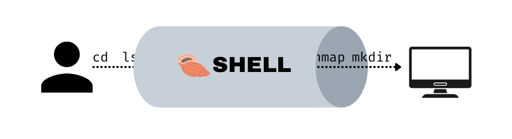
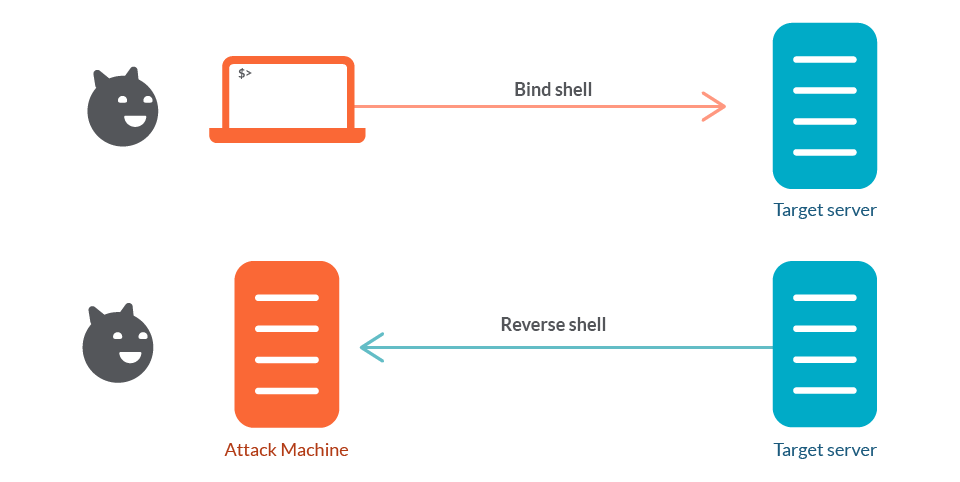

### What is a shell?

It was like a direct communication line between you and the computer. The shell is the line, the road, the tunnel where you can connect and give instruction, command, and control a computer.  This shell connection can be locally or remotely. The example of doing a shell connection locally is your usual linux activity using bash on a terminal or using a cmd on a windows. Meanwhile we can also do a shell connection remotely using shell protocols like ssh and telnet. 

### What is a reverse shell then?

Unlike normal bind shell that we use to connect remotely, a reverse shell will make the server call back to us to bind a shell connection. This is a really sneaky way to take over a server and bypassing the firewall since the firewall usually deny a shell connection into the network but allow a shell connection outside the network. 

The reverse shell is like a message packed into a bottle. A reverse-shell script to bind a connection into the attacker machine is usually packed into a file and when run it was runned, it calls back into the attackers machine to bind a connection. 

Pre-made reverse shell scripts website:
- https://www.revshells.com/

---

#command_and_control #CnC
