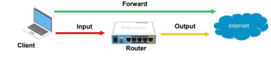
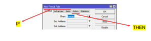
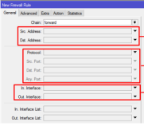
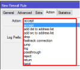

# The Firewall
source: https://www.idn.id/tutorial-menggunakan-firewall-di-mikrotik/

Firewall is a security system used to protect our network from incoming threat. Firewall is used to protect the network either coming from the WAN (Internet) or the LAN (Local). 

## Why Firewall
- It is used to protect our network either from WAN(Internet) or LAN(Local).
- Protect the network that is going through the router.
- Firewall feature in RouterOS are in IP > Firewall.
- Basic firewall are in IP > Firewall > Filter Rules.

## Firewall - Filter Rules
- A really basic firewall rules in RouterOS
- Every filter rules are organized in a sequence of chain (berurutan dalam sebuah rantai).
- Every chain will be read by the router from top to bottom.
- The packet will be matched with a criteria inside a chain, if matched the packed will be executed. If not the packet will be matched with the rules inside the next chain untill it matched a criteria. 
- There are 3 default chain input, output, and forward.
- We could also make our own custom chains as we want. By default if there are no filter rules, all traffic that is coming from, pass, and out of the router will be allowed even if it was unsafe.

## Firewall - Simple Packet Flow

There are three bacis packet flow
- Input - to the router
- Forward - pass the router
- Output - from the router 

#### More About Default Chains
1. input
	This chains handle the packet that is going and addressed into the router itself. For example remote access requests to the router.

2. forward
	This chain handle the packet that is going through (pass) the router. For example ping from client pc into the internet.

3. output 
	This chain handle the packet that is originated from the router and going into another network. For example iptables and nftables.

## Firewall - If condition
- IF the packet meets the criteria we created.
- THEN what are the action that will be gaven to that package.
- In firewall Filter, the IF statement was in the General, Advanced, and Extra menu wile THEN was in Action.

#### Firewall Filter - If(General)

IP > Firewall Filter > General

- Source address. 
- Destination address (alamat tujuan) the format could be a specific IP, specific network, or even every network (any). 
- Protocol (TCP/UDP/ICMP, etc). 
- Source Port (source port/from the client). 
- Destination port.
- Interface (traffic in or out).

#### Firewall Filter - Then(Action)

- IP > Firewall Filter > Action
- accept - packet will be accepted(allowed to execute)
- drop - packet will be denied(dropped)
- jump - packet will be jumped to the specified custom chain
- log -  create a log for the specified packet
- passthrough - packet will be executed and will be allowed to be filtered by the next rule(chain)
- reject - the same as drop but also will return an ICMP reject packet
- return - the packet will be returned where the action jump location will be made
- tarpit - will open a shadow port inside the router. As if every port in the router is active but can never be accessed.

- "add-dst-to address-list" - destination addrest will be added to the address-list.
- "add-src-to address-list" - source address will be added to the address-list.
- fasstrack connection - alternative feature for speedboost traffic data.

### Frequently used port

| Port/transmission | Service    |
|-------------------|------------|
| 80/tcp            | HTTP       |
| 443/tcp           | HTTPS      |
| 22/tcp            | ssh        |
| 23/tcp            | telnet     |
| 20,21/tcp         | ftp        |  
| 8291/tcp          | WinBox     |
| 5678/tcp          | MNDP       |
| 20561/tcp         | Mac Winbox |

