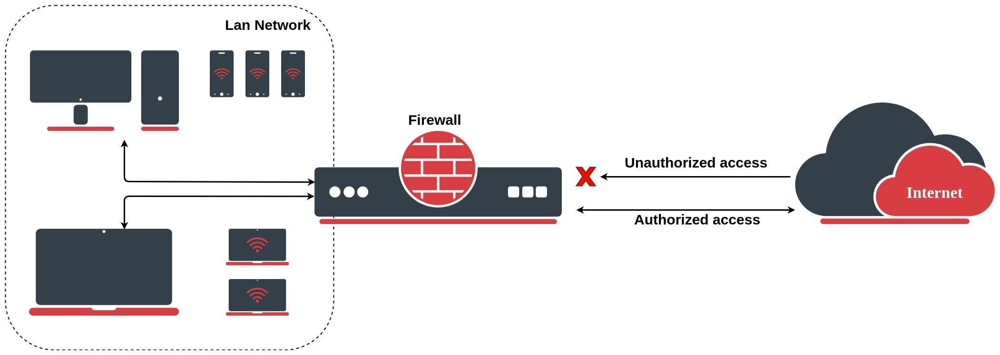
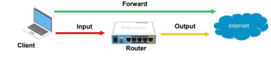
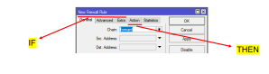
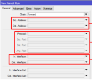
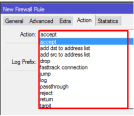

# The Firewall
source: https://www.idn.id/tutorial-menggunakan-firewall-di-mikrotik/

Firewall is a security system used to protect our network from incoming threat. Firewall is used to protect the network either coming from the WAN (Internet) or the LAN (Local).

# Why Firewall
- It is used to protect our network either from WAN(Internet) or LAN(Local).
- Protect the network that is going through the router.
- Firewall feature in RouterOS are in IP > Firewall.
- Basic firewall are in IP > Firewall > Filter Rules.

# Firewall - Filter Rules
- A really basic firewall rules in RouterOS
- Every filter rules are organized in a sequence of chain (berurutan dalam sebuah rantai).
- Every chain will be read by the router from top to bottom.
- The packet will be matched with a criteria inside a chain, if matched the packed will be executed. If not the packet will be matched with the rules inside the next chain untill it matched a criteria.
- There are 3 default chain input, output, and forward.
- We could also make our own custom chains as we want. By default if there are no filter rules, all traffic that is coming from, pass, and out of the router will be allowed even if it was unsafe.

# Firewall - Simple Packet Flow

There are three bacis packet flow
- Input - to the router
- Forward - pass the router
- Output - from the router

### More About Default Chains
1. input
	This chains handle the packet that is going and addressed into the router itself. For example remote access requests to the router.

2. forward
	This chain handle the packet that is going through (pass) the router. For example ping from client pc into the internet.

3. output
	This chain handle the packet that is originated from the router and going into another network. For example iptables and nftables.

### Mangle Specific Chain
1. Preroute
	This chains handle packet that is going into and through the router. Preroute isn't exactly input + forward, preroute happen when the packet going inside the router and before the routing determine wether the packet will go into the router or forward the router.

2. Postroute
	This chains handle packet that is goint out and through the router. Almost like preroute but in reverse. It handle packet before the routing determine wether the packet going out is from the router or is it being forwarded to other router.

	- Packet going in -> Preroute -> input
	- Packet goint in -> preroute -> forward -> postroute -> packet going out
	- Packet from router -> postroute -> packet going out

# Firewall - If condition
- IF the packet meets the criteria we created.
- THEN what are the action that will be gaven to that package.
- In firewall Filter, the IF statement was in the General, Advanced, and Extra menu wile THEN was in Action.

### Firewall Filter - If(General)

IP > Firewall Filter > General

- Source address.
- Destination address (alamat tujuan) the format could be a specific IP, specific network, or even every network (any).
- Protocol (TCP/UDP/ICMP, etc).
- Source Port (source port/from the client).
- Destination port.
- Interface (traffic in or out).

### Firewall Filter - Then(Action)

- IP > Firewall Filter > Action
- accept - packet will be accepted(allowed to execute)
- drop - packet will be denied(dropped)
- jump - packet will be jumped to the specified custom chain
- log -  create a log for the specified packet
- passthrough - packet will be allowed to executed and will be continued to be filtered by the next rule(chain)
- reject - the same as drop but also will return an ICMP reject packet
- return - the packet will be returned where the action jump location will be made
- tarpit - will open a shadow port inside the router. As if every port in the router is active but can never be accessed.

- "add-dst-to address-list" - destination addrest will be added to the address-list.
- "add-src-to address-list" - source address will be added to the address-list.
- fasstrack connection - alternative feature for speedboost traffic data.

### Frequently used port

| Port/transmission | Service    |
| ----------------- | ---------- |
| 80/tcp            | HTTP       |
| 443/tcp           | HTTPS      |
| 22/tcp            | ssh        |
| 23/tcp            | telnet     |
| 20,21/tcp         | ftp        |
| 8291/tcp          | WinBox     |
| 5678/tcp          | MNDP       |
| 20561/tcp         | Mac Winbox |

# Firewall - Log
- Log is a feature used to display an information / activity that is happening in the router
- We can create or add any kind of activity log as we want through firewall filter with activity log

### Making a log to track ping activity that is going to the router

- Go to IP > Firewall > Filter Rules
- Set the chain to input and protocol to icmp
- Set the action to log and log prefix to incoming-ping
- Try to ping the router and analyze the log

# Firewall - Addres List
- Firewall address list allow a user to create a list of IP addresses grouped together under a commmon name. This may not be as usefull in a small network but it comes really handy in a larger network like ISP.
- A line of address-list can be a form of subnet, ip range, or a specific IP.
- Address list could be made automatically utilizing the "add-to-address list" action.
- We could also set if the address-list could be made permanently or not using the timeout feature.

# Firewall - Blocking Sites
- You can also block any specific website to be accessed using Content and TLS Host parameter
- Content parameter will use a specific keyword inside that sites
- TLS Host will use a domain name to define a sites. You can also use wildcard(`*`) with it like `*youtube.com`.

# Firewall - NAT
- NAT is a method used to connect multiple computer into the internet with just a single or more public ip address.
- NAT works with the same principle as Filter Rule "IF-THEN".

Mikrotik Has 2 Types of NAT:
1. Srcnat, used when the client inside the router wants to go outside the internet.
	- Masquerade: Used to connect a local network into the internet using a *dynamic* public ip.
	- src-nat: Used to connect a local network into the internet using a *static* public ip.
2. Dstnat, used when the client from the internet want to access the local address.
	- dst-nat: used to access local network through the internet(port forwarding).
	- redirect: used to redirect a traffic into a specific service inside the router itself, for example:
		- hotspot.
		- webproxy.
		- dns server.

# Firewall - Mangle

Firewall Mangle is used to mark a specific packet, connection, or even routes. The mark made by firewall mangle can be applied to bandwit management like simple queue and routing. Firewall mangle is basically another way to organize and give you more control over the packet that is going through the router.

### Why use mangle?

With firewall mangle

### Most Used Action in Mangle
1.  **Packet-Mark**
	 Packet-mark usually used on a bandwith management scenario like simple Queue

2. **Routing-Mark**
	Routing-mark usually used for policy route(routing scenario).

3. **Connection-Mark**
	Connection-mark usually paired with other mark like Connection-Mark + Packet-Mark and Connection-Mark + Routing-Mark.
