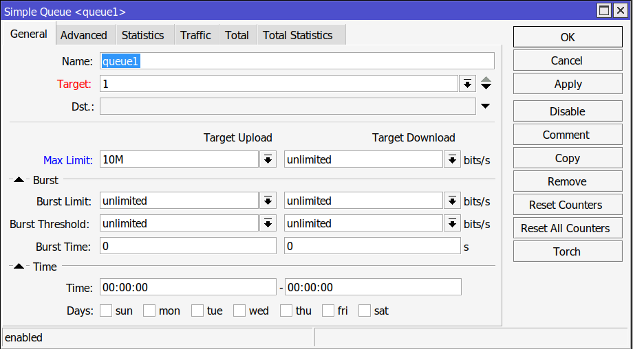
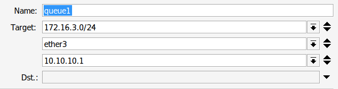

# Bandwith Management

## #1 - Simple Queue
Simple queue is a simple method to limit a bandwith in MikroTik RouterOS. Target to be limited could be a specific IP, specific Port, or even an entire network range.

- If the queue color is red then it means that the queue is full.
- The target is not just an ip address, it could also be an entire network, an interface, and a subnet.
- Want a network and a port at the same time? Sure, just add using the down arrow.

## #2 - Burst
Bursts is used to allow users to exceed the normal limit for a short amount of time to improve user experiences such as innitial phase of Download and Upload.

### #2.1 - Burst Parameters
- *Burst Limit:* The maximum data allowed during the burst period. This should be set to be higher than the max limit for the feature to be effective

- *Burst Threshold:*  The average rate threshold that trigger or disable the burst period.  
